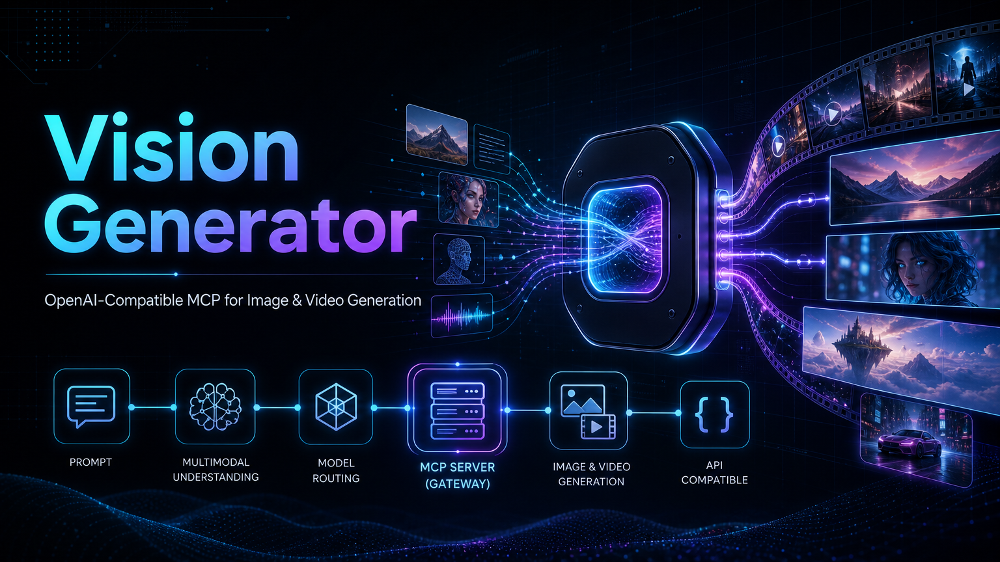

<div align="center">

# 🎨 Vision Generator MCP

### Local-first MCP server for image & video generation through OpenAI-compatible providers

<p>
  
  
  
  
</p>

**Discover models automatically · generate media locally · save outputs explicitly · avoid context bloat**

<p>
  
</p>

</div>

---

## 🚀 Why this exists

Most image/video APIs force clients to understand:

- different endpoints
- inconsistent payloads
- mixed sync/async behavior
- provider-specific output handling
- confusing model lists with text-only models mixed in

**Vision Generator MCP** gives you one local MCP layer that:

- auto-discovers models from the provider
- filters only image/video-capable models
- normalizes generation flows
- writes outputs to a folder you choose
- keeps chat context clean by **not** returning huge base64 images

---

## ✨ Highlights

| Feature | What you get |
|---|---|
| **Auto model discovery** | Uses [`GET /models`](src/providers/openai-compatible.adapter.ts:41) at runtime |
| **Vision-only filtering** | Hides irrelevant text-only models via [`buildVisionModelRegistry()`](src/core/model-discovery.ts:42) |
| **Required output folder** | Every generated asset has a clear `final_path` |
| **Async video flow** | Submit + poll video jobs cleanly |
| **Local-first workflow** | Great for desktop / VS Code / Claude workflows |
| **Configurable timeouts** | Provider and download timeouts are configurable from MCP settings |
| **Modular architecture** | Clean separation across [`src/providers/`](src/providers/), [`src/core/`](src/core/), [`src/tools/`](src/tools/), [`src/validation/`](src/validation/) |

---

## 🧭 How it works

```text
┌───────────────────────────────────────────────┐
│ MCP Client / Agent                            │
│ Claude / VS Code / Desktop / Local workflow   │
└───────────────────────┬───────────────────────┘
                        │
                        │ MCP tools
                        ▼
┌───────────────────────────────────────────────┐
│ Vision Generator MCP                          │
│-----------------------------------------------│
│ Tool handlers                                 │
│ Validation                                    │
│ Vision service                                │
│ Model discovery                               │
│ Capability filtering                          │
│ Output publishing                             │
└───────────────────────┬───────────────────────┘
                        │
                        │ Adapter abstraction
                        ▼
┌───────────────────────────────────────────────┐
│ OpenAI-compatible provider adapter            │
└───────────────────────┬───────────────────────┘
                        │
                        │ HTTP
                        ▼
┌───────────────────────────────────────────────┐
│ Provider API                                  │
│ /models                                       │
│ /images/generations                           │
│ /images/edits                                 │
│ /videos/generations                           │
└───────────────────────────────────────────────┘
```

---

## 🧱 Project structure

```text
.
├─ README.md
├─ package.json
├─ tsconfig.json
├─ plans/
│  └─ mcp-image-video-architecture-plan.md
├─ src/
│  ├─ index.ts
│  ├─ config/
│  │  └─ providers.ts
│  ├─ core/
│  │  ├─ errors.ts
│  │  ├─ file-output-publisher.ts
│  │  ├─ model-discovery.ts
│  │  └─ vision-service.ts
│  ├─ providers/
│  │  ├─ base-provider.ts
│  │  ├─ openai-compatible.adapter.ts
│  │  └─ provider-factory.ts
│  ├─ tools/
│  │  ├─ animate-image.ts
│  │  ├─ edit-image.ts
│  │  ├─ generate-image.ts
│  │  ├─ generate-video.ts
│  │  ├─ get-job-status.ts
│  │  ├─ get-model-capabilities.ts
│  │  └─ list-models.ts
│  ├─ types/
│  │  └─ contracts.ts
│  ├─ utils/
│  │  ├─ mime.ts
│  │  └─ path.ts
│  └─ validation/
│     ├─ common.ts
│     ├─ image.ts
│     ├─ job.ts
│     ├─ output.ts
│     ├─ schemas.ts
│     └─ video.ts
└─ outputs/
```

---

## ✅ Current supported workflow

### Image
- text-to-image via [`generateImage()`](src/core/vision-service.ts:60)
- image editing via [`editImage()`](src/core/vision-service.ts:82)

### Video
- text-to-video via [`generateVideo()`](src/core/vision-service.ts:104)
- image-to-video via [`animateImage()`](src/core/vision-service.ts:125)
- async polling via [`getJobStatus()`](src/core/vision-service.ts:146)

### Discovery
- runtime model discovery via [`listModels()`](src/providers/openai-compatible.adapter.ts:41)
- vision filtering via [`buildVisionModelRegistry()`](src/core/model-discovery.ts:42)

---

## 📦 Installation

### Requirements
- Node.js 18+
- npm
- an OpenAI-compatible provider endpoint

### Install from npm
```bash
npm install -g vision-generator-mcp
```

### Run installed binary
```bash
vision-generator-mcp
```

### Local development install
```bash
npm install
```

### Type-check
```bash
npm run check
```

### Build
```bash
npm run build
```

### Publishable package notes
- CLI entry is exposed via [`bin`](package.json:20)
- installable package files are limited via [`files`](package.json:23)
- build runs automatically before publish/install from source via [`prepare`](package.json:31)

---

## ⚙️ MCP settings

This server reads configuration from MCP settings using:
- `PROVIDER_BASE_URL`
- `PROVIDER_API_KEY`
- `PROVIDER_TIMEOUT_MS`
- `DOWNLOAD_TIMEOUT_MS`

Example configuration:

```json
{
  "mcpServers": {
    "vision-generator": {
      "command": "node",
      "args": [
        "d:/All_project/own/AI_Coder/Native Tools/vision-generator/build/index.js"
      ],
      "disabled": false,
      "timeout": 600,
      "alwaysAllow": [],
      "disabledTools": [],
      "env": {
        "PROVIDER_BASE_URL": "https://ai.rayzs.qzz.io/v1",
        "PROVIDER_API_KEY": "your-api-key-1",
        "PROVIDER_TIMEOUT_MS": "300000",
        "DOWNLOAD_TIMEOUT_MS": "300000"
      }
    }
  }
}
```

### Timeout layers

| Timeout | Scope |
|---|---|
| `timeout` in MCP settings | How long the MCP host waits for the server tool call |
| [`PROVIDER_TIMEOUT_MS`](src/config/providers.ts:14) | Timeout for provider API requests |
| [`DOWNLOAD_TIMEOUT_MS`](src/config/providers.ts:15) | Timeout for binary asset download |

Current provider timeout config is loaded in [`loadProviderConfig()`](src/config/providers.ts:10) and applied in [`OpenAICompatibleAdapter`](src/providers/openai-compatible.adapter.ts:29).

---

## 📁 Output strategy

> `output.directory` is **required** for image and video tools.

Recommended folders:
- [`outputs/`](outputs/)
- `d:/All_project/own/AI_Coder/Native Tools/vision-generator/outputs`

Why this is better:
- every result has a clear location
- no hidden temp output behavior
- no base64 image spam in chat context
- much better for GitHub-friendly, local-first workflows

---

## 🛠️ Tool reference

## [`list_models`](src/tools/list-models.ts:1)
Discover image/video-capable models.

### Example output
```json
{
  "provider": "https://ai.rayzs.qzz.io/v1",
  "models": [
    {
      "id": "gpt-image-2",
      "operations": {
        "image_generation": true,
        "image_editing": true,
        "image_variation": false,
        "text_to_video": false,
        "image_to_video": false
      }
    }
  ]
}
```

---

## [`get_model_capabilities`](src/tools/get-model-capabilities.ts:1)
Inspect a discovered model.

### Example input
```json
{
  "model": "gpt-image-2"
}
```

---

## [`generate_image`](src/tools/generate-image.ts:1)
Generate an image and write it to your chosen folder.

### Example input
```json
{
  "model": "gpt-image-2",
  "prompt": "A futuristic Jakarta skyline at sunset, cinematic lighting",
  "aspect_ratio": "16:9",
  "resolution": "1536x1024",
  "output": {
    "directory": "d:/All_project/own/AI_Coder/Native Tools/vision-generator/outputs",
    "filename_prefix": "jakarta-future-city",
    "create_directory": true
  }
}
```

### Example output
```json
{
  "status": "succeeded",
  "provider": "https://ai.rayzs.qzz.io/v1",
  "model": "gpt-image-2",
  "operation": "image_generation",
  "outputs": [
    {
      "type": "image",
      "mime_type": "image/png",
      "final_path": "d:/All_project/own/AI_Coder/Native Tools/vision-generator/outputs/jakarta-future-city_2026-05-19T01-00-00-000Z.png",
      "width": 1536,
      "height": 1024
    }
  ]
}
```

---

## [`edit_image`](src/tools/edit-image.ts:1)
Edit a local image and save the output.

### Example input
```json
{
  "model": "gpt-image-2",
  "prompt": "Replace the background with a neon cyberpunk street",
  "image_path": "d:/assets/input.png",
  "output": {
    "directory": "d:/All_project/own/AI_Coder/Native Tools/vision-generator/outputs",
    "filename_prefix": "edited-scene",
    "create_directory": true
  }
}
```

---

## [`generate_video`](src/tools/generate-video.ts:1)
Submit an async text-to-video job.

### Example input
```json
{
  "model": "your-video-model",
  "prompt": "A cinematic aerial shot flying over a futuristic city",
  "duration_seconds": 5,
  "fps": 24,
  "output": {
    "directory": "d:/All_project/own/AI_Coder/Native Tools/vision-generator/outputs",
    "filename_prefix": "future-city-video",
    "create_directory": true
  }
}
```

### Example submit result
```json
{
  "status": "submitted",
  "provider": "https://ai.rayzs.qzz.io/v1",
  "model": "your-video-model",
  "operation": "text_to_video",
  "job_id": "video_...",
  "provider_job_id": "provider_...",
  "outputs": []
}
```

---

## [`animate_image`](src/tools/animate-image.ts:1)
Submit an async image-to-video job.

## [`get_job_status`](src/tools/get-job-status.ts:1)
Poll video job status until the final file is downloaded and written to your chosen folder.

---

## 🧩 Implementation map

| Concern | Entry point |
|---|---|
| Composition root | [`src/index.ts`](src/index.ts) |
| Main orchestration | [`src/core/vision-service.ts`](src/core/vision-service.ts) |
| Provider contract | [`src/providers/base-provider.ts`](src/providers/base-provider.ts) |
| OpenAI-compatible provider | [`src/providers/openai-compatible.adapter.ts`](src/providers/openai-compatible.adapter.ts) |
| Adapter selection | [`src/providers/provider-factory.ts`](src/providers/provider-factory.ts) |
| Model discovery | [`src/core/model-discovery.ts`](src/core/model-discovery.ts) |
| File output | [`src/core/file-output-publisher.ts`](src/core/file-output-publisher.ts) |
| Validation layer | [`src/validation/`](src/validation/) |
| Tool handlers | [`src/tools/`](src/tools/) |
| Utilities | [`src/utils/`](src/utils/) |

---

## 🔮 Future provider list

### Easiest next additions
- more OpenAI-compatible gateways
- provider-specific quirks layer

### Best next adapters
- [`Replicate`](src/providers/replicate.adapter.ts:1)
- [`fal`](src/providers/fal.adapter.ts:1)
- [`RunPod`](src/providers/runpod.adapter.ts:1)

### Later / higher-effort adapters
- [`Stability`](src/providers/stability.adapter.ts:1)
- [`Leonardo`](src/providers/leonardo.adapter.ts:1)
- [`Pika`](src/providers/pika.adapter.ts:1)
- [`Luma`](src/providers/luma.adapter.ts:1)

> These are roadmap targets, not currently implemented files.

---

## 🧪 Development workflow

```bash
npm install
npm run check
npm run build
```

After changing MCP settings or rebuilding:
- reload the MCP runtime / extension
- start a fresh session if needed

---

## ✅ Project status

- local MCP server implemented
- OpenAI-compatible provider adapter implemented
- modular structure aligned with the plan
- explicit output directory required
- configurable provider/download timeout support added
- no image base64 context bloat
- build verified
- ready for runtime MCP usage after MCP reload
